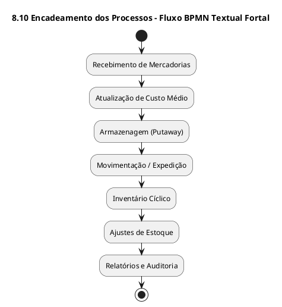

# 🏢 Supermercado Fortal
## SGE – Sistema de Gestão de Estoque
### Documento: SIPOC e BPMN Textual – Versão 1.0 (2025-10-27)
**Elaborado por:** Vinicius Silveira
**Padrão:** ABNT Técnico / BPMN Textual Fortal-2025

---

## Sumário
1. Introdução  
2. Estrutura do Modelo SIPOC  
3. Processos SIPOC  
 3.1 Recebimento de Mercadorias  
 3.2 Atualização de Custo Médio  
 3.3 Armazenagem (Putaway)  
 3.4 Movimentação e Expedição  
 3.5 Inventário Cíclico  
 3.6 Ajustes de Estoque  
 3.7 Relatórios e Auditoria  
4. Modelagem BPMN Textual  
5. Controle de Versão e Aprovação  

---

## 1 Introdução

O presente documento define, para o **SGE – Sistema de Gestão de Estoque Fortal**, os **modelos SIPOC e BPMN Textual** correspondentes aos processos-chave do negócio.  

O objetivo é proporcionar **visão integrada ponta-a-ponta**, garantindo clareza sobre fornecedores, entradas, atividades, saídas e clientes internos, além de **padronizar a representação de fluxos operacionais** para análise, automação e auditoria.  

---

## 2 Estrutura do Modelo SIPOC

| Elemento | Descrição |
|-----------|-----------|
| **Supplier (Fornecedor)** | Origem das informações, insumos ou materiais. |
| **Input (Entrada)** | Dados, documentos, eventos ou produtos que iniciam o processo. |
| **Process (Processo)** | Conjunto de atividades transformadoras no SGE. |
| **Output (Saída)** | Resultados gerados ou produtos de saída. |
| **Customer (Cliente)** | Destinatário interno ou externo dos resultados. |

---

## 3 Processos SIPOC

### 3.1 SIPOC – Recebimento de Mercadorias

| Elemento | Conteúdo |
|-----------|-----------|
| **Supplier** | Fornecedor, Compras, Transportadora |
| **Input** | NF-e, Pedido de Compra, ASN |
| **Process** | Conferir mercadorias ↔ NF-e ↔ pedido; validar fornecedor; registrar recebimento no SGE |
| **Output** | Estoque atualizado, divergências registradas, log de recebimento |
| **Customer** | Estoque, Compras, Financeiro |

---

### 3.2 SIPOC – Atualização de Custo Médio

| Elemento | Conteúdo |
|-----------|-----------|
| **Supplier** | Recebimento, Compras, Financeiro |
| **Input** | Dados de nota fiscal, saldo anterior, custo unitário |
| **Process** | Calcular custo médio (AVG); atualizar saldo e CM; registrar log e evento no BI |
| **Output** | Novo custo médio por SKU, relatório de custo, registro de auditoria |
| **Customer** | Contabilidade, Gestão de Estoque, Diretoria |

---

### 3.3 SIPOC – Armazenagem (Putaway)

| Elemento | Conteúdo |
|-----------|-----------|
| **Supplier** | Recebimento Valido |
| **Input** | Produtos liberados, mapa de endereçamento |
| **Process** | Endereçar SKU em local disponível segundo classe ABC e giro |
| **Output** | Localização atualizada, saldo por endereço |
| **Customer** | Operação de Expedição, Gestor de CD |

---

### 3.4 SIPOC – Movimentação e Expedição

| Elemento | Conteúdo |
|-----------|-----------|
| **Supplier** | Lojas, Planejamento, CD |
| **Input** | Solicitação de transferência, pedido de saída |
| **Process** | Separar produtos, gerar requisição, confirmar expedição |
| **Output** | Saída registrada, saldo atualizado, comprovante |
| **Customer** | Lojas Fortal, Financeiro |

---

### 3.5 SIPOC – Inventário Cíclico

| Elemento | Conteúdo |
|-----------|-----------|
| **Supplier** | Auditoria, Sistema SGE |
| **Input** | Lista de itens para contagem |
| **Process** | Contar itens, comparar saldo, registrar divergências |
| **Output** | Relatório de inventário, propostas de ajuste |
| **Customer** | Auditoria, Gestor de Estoque |

---

### 3.6 SIPOC – Ajustes de Estoque

| Elemento | Conteúdo |
|-----------|-----------|
| **Supplier** | Inventário, Auditoria |
| **Input** | Divergências identificadas |
| **Process** | Analisar motivos, aprovar duplamente, corrigir saldo |
| **Output** | Ajuste registrado, log de auditoria |
| **Customer** | Gestão Executiva, Contabilidade |

---

### 3.7 SIPOC – Relatórios e Auditoria

| Elemento | Conteúdo |
|-----------|-----------|
| **Supplier** | Todos os processos SGE |
| **Input** | Dados de movimentação, custos, inventário |
| **Process** | Consolidar indicadores → calcular KPIs → gerar relatórios |
| **Output** | Dashboards, relatórios analíticos, alertas gerenciais |
| **Customer** | Diretoria Fortal, Auditoria Interna, Gestão de CD |

---

## 4 Modelagem BPMN Textual

O modelo BPMN Textual Fortal apresenta a sequência macro dos processos no formato PlantUML para integração posterior em modeladores gráficos.

### Resumo dos Fluxos

| Etapa | Descrição | Gatilho Entrada | Saída |
|-------|------------|----------------|--------|
| 1 | Recebimento de Mercadorias | NF-e e pedido de compra | Estoque atualizado |
| 2 | Atualização de Custo Médio | Dados de recebimento | Novo custo médio por SKU |
| 3 | Armazenagem (Putaway) | Itens recebidos | Endereçamento registrado |
| 4 | Movimentação e Expedição | Pedido de transferência | Saída confirmada |
| 5 | Inventário Cíclico | Agendamento ou alerta | Relatório de inventário |
| 6 | Ajustes de Estoque | Divergência aprovada | Saldo corrigido |
| 7 | Relatórios e Auditoria | Dados de todas as rotinas | Dashboards e KPIs atualizados |

---

## 5 Controle de Versão e Aprovação

| Campo | Valor |
|--------|--------|
| **Versão** | 1.0 |
| **Data** | 27/10/2025 |
| **Elaborado por** | Prof. Francisco Araújo – Analista de Negócios |
| **Revisado por** | Comitê de Processos e TI – Supermercado Fortal |
| **Aprovado por** | Direção Executiva – Supermercado Fortal |
| **Observações** | Documento base de referência para modelagem, rastreabilidade e automação de processos SGE. |
