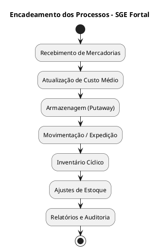

# 🏢 Supermercado Fortal
## SGE – Sistema de Gestão de Estoque
### Documento: Narrativas de Processo – Versão 1.0 (2025-10-27)
**Elaborado por:** Vinicius Silveira
**Padrão:** ABNT Técnico / BPMN Textual Fortal-2025

---

## Sumário
1. Introdução  
2. Estrutura da Narrativa de Processo  
3. Processos Principais  
 3.1 Recebimento de Mercadorias  
  3.2 Atualização de Custo Médio  
  3.3 Armazenagem (Putaway)  
  3.4 Movimentação e Expedição  
  3.5 Inventário Cíclico  
  3.6 Ajustes de Estoque  
  3.7 Relatórios e Auditoria  
4. Anexo: Diagramas PlantUML Textuais  
5. Rastreabilidade entre Processos, Requisitos e Indicadores  
6. Controle de Versão e Aprovação  

---

## 1. Introdução

O presente documento descreve, de forma analítica e narrativa, os **processos de negócio modelados no SGE – Sistema de Gestão de Estoque** do **Supermercado Fortal**, abrangendo suas **entradas, saídas, atores, fluxos, exceções e SLAs**.  

As narrativas seguem o padrão **BPMN Textual Fortal-ABNT 2025** e são utilizadas como base para:
- Modelagem de processos em **PlantUML** e ferramentas BPM (Bizagi / Camunda).  
- Construção de **SIPOCs**, **casos de uso** e **requisitos funcionais (ERF/RNF)**.  
- Alimentação do **modelo conceitual**, **scripts SQL** e **rotinas automáticas**.  

---

## 2. Estrutura da Narrativa de Processo

| Campo | Descrição |
|--------|------------|
| **Identificador** | Código único do processo (ex.: PRC-REC-001). |
| **Nome do Processo** | Nome e finalidade principal. |
| **Objetivo** | Propósito do processo no contexto do negócio. |
| **Atores Envolvidos** | Papéis e funções executoras e de controle. |
| **Entradas** | Dados, eventos ou documentos necessários à execução. |
| **Saídas** | Resultados, relatórios ou atualizações geradas. |
| **Fluxo Principal** | Sequência detalhada das etapas operacionais. |
| **Exceções** | Erros, desvios ou situações extraordinárias. |
| **SLA / Métricas** | Prazos, tempos e indicadores mensuráveis. |

---

## 3. Processos Principais

### 3.1 Processo: Recebimento de Mercadorias
**Identificador:** PRC-REC-001  
**Objetivo:** Garantir que todos os produtos recebidos estejam conformes à NF-e e ao pedido de compra.  
**Atores:** Operador de Estoque, Conferente, Gestor de Compras, Sistema SGE.  
**Entradas:** NF-e eletrônica, ASN, Pedido de Compra.  
**Saídas:** Registro de recebimento e atualização de estoque.  

**Fluxo Principal:**  
1. Operador seleciona NF-e e inicia conferência.  
2. Sistema valida fornecedor e pedido vinculado.  
3. Conferente realiza contagem física e compara com o sistema.  
4. Divergências são registradas.  
5. Sistema aciona atualização de custo médio (PRC-CST-007).  
6. Gera log de auditoria e encerra o processo.  

**Exceções:** NF-e não localizada; produto não cadastrado.  
**SLA:** 15 minutos por carga, acurácia ≥ 98 %.  

---

### 3.2 Processo: Atualização de Custo Médio
**Identificador:** PRC-CST-007  
**Objetivo:** Executar o cálculo e atualização do custo médio (AVG), garantindo rastreabilidade e integridade de dados.  
**Atores:** Operador de Estoque, Gestor de Operações, Compras, Auditoria Interna, TI/Administrador.  
**Entradas:** NF-e validadas, custo anterior, saldo anterior.  
**Saídas:** Novo custo médio calculado, log de auditoria, atualização no BI.  

**Fluxo Passo a Passo:**  
1. Validar pré-condições (saldo ≥ 0, SKU ativo).  
2. Bloquear SKU para atualização transacional.  
3. Calcular custo médio:  
 CM_novo = (Q_ant × CM_ant + Q_ent × C_ent) / (Q_ant + Q_ent).  
4. Atualizar saldo e custo médio no banco.  
5. Gerar registro na tabela `tb_movimentacao_custo`.  
6. Publicar evento para BI Fortal.  

**Exceções:** Saldo negativo, documento sem valor, devolução ou bonificação.  
**Regras Relacionadas:** RN-CST-001, RN-CST-002, RN-AJU-004.  
**KPIs:** Acurácia de Custo, Tempo de Processamento, Reprocessos.  
**SLA:** 2 s por cálculo, trilha de auditoria obrigatória.  

---

### 3.3 Processo: Armazenagem (Putaway)
**Identificador:** PRC-ARM-002  
**Objetivo:** Posicionar produtos em endereços adequados.  
**Atores:** Operador de Estoque, Gestor de CD.  
**Entradas:** Produtos validados e mapa de endereçamento.  
**Saídas:** Atualização de localização no SGE.  

**Fluxo Principal:**  
1. Sistema sugere endereço com base em giro e categoria.  
2. Operador armazena produto e confirma no SGE.  
3. Sistema registra endereço, data e operador.  

**Exceções:** Endereço indisponível.  
**SLA:** 5 min por SKU.  

---

### 3.4 Processo: Movimentação e Expedição
**Identificador:** PRC-MOV-003  
**Objetivo:** Registrar e controlar transferências e saídas.  
**Atores:** Operador de Expedição, Gestor Logístico, Sistema SGE.  
**Entradas:** Pedido de movimentação, solicitação de loja.  
**Saídas:** Atualização de saldo, comprovante de saída.  

**Fluxo Principal:**  
1. Gestor aprova pedido de movimentação.  
2. Sistema bloqueia saldo e gera requisição.  
3. Operador confirma expedição.  
4. Sistema atualiza estoque e custo.  

**Exceções:** SKU indisponível → alerta de ruptura.  
**SLA:** 30 min entre solicitação e conclusão.  

---

### 3.5 Processo: Inventário Cíclico
**Identificador:** PRC-INV-004  
**Objetivo:** Garantir acurácia de estoque por contagens periódicas.  
**Atores:** Operador de Estoque, Auditor Interno, Gestor de Estoque.  
**Entradas:** Lista de itens para contagem.  
**Saídas:** Relatório de divergências e ajustes.  

**Fluxo Principal:**  
1. Sistema gera lista de contagem ABC.  
2. Operador realiza contagem física.  
3. Sistema compara com saldo digital.  
4. Divergências são analisadas e ajustadas.  

**Exceções:** Item não localizado → recontagem.  
**SLA:** 100 % dos SKUs Classe A / mês.  

---

### 3.6 Processo: Ajustes de Estoque
**Identificador:** PRC-AJU-005  
**Objetivo:** Corrigir divergências entre físico e sistema.  
**Atores:** Gestor de Estoque, Auditor, Sistema SGE.  
**Entradas:** Relatório de inventário.  
**Saídas:** Registro de ajuste e atualização de saldo.  

**Fluxo Principal:**  
1. Auditor propõe ajuste com justificativa.  
2. Sistema exige dupla aprovação.  
3. Aplicar correção e registrar log.  

**Exceções:** Falta de justificativa → rejeição.  
**SLA:** Dupla aprovação obrigatória > R$ 1.000.  

---

### 3.7 Processo: Relatórios e Auditoria
**Identificador:** PRC-REL-006  
**Objetivo:** Consolidar e disponibilizar relatórios e dashboards.  
**Atores:** Analista de Negócios, Auditor, Diretoria.  
**Entradas:** Dados de movimentação e inventário.  
**Saídas:** Relatórios analíticos, indicadores e dashboards.  

**Fluxo Principal:**  
1. Sistema consolida dados e KPIs.  
2. Gera relatórios e dashboards automáticos.  
3. Atualiza BI Fortal e envia alertas.  

**Exceções:** Falha na rotina ETL.  
**SLA:** Atualização diária às 02h00.  

---

## 4. Anexo: Diagramas PlantUML Textuais

---

## 5. Rastreabilidade entre Processos, Requisitos e Indicadores

| Processo | RF | RNF | Regras de Negócio | KPIs |
|-----------|----|-----|-------------------|-------|
| PRC-REC-001 | RF-REC-001, RF-REC-002 | RNF-SEG-001 | RN-REC-001, RN-REC-002 | KPI-ACUR-01, KPI-TMP-REC |
| PRC-CST-007 | RF-CST-001, RF-CST-002 | RNF-PERF-001, RNF-SEG-003 | RN-CST-001, RN-AJU-004 | KPI-CUST-01, KPI-TMP-PROC |
| PRC-ARM-002 | RF-ARM-001 | RNF-USAB-001 | RN-ARM-001 | KPI-GIRO-01, KPI-TMP-ARM |
| PRC-MOV-003 | RF-MOV-001, RF-MOV-002 | RNF-DISP-001 | RN-MOV-001 | KPI-RUPT-01, KPI-GIRO-02 |
| PRC-INV-004 | RF-INV-001, RF-INV-002 | RNF-DISP-002 | RN-INV-003 | KPI-ACUR-02, KPI-COV-ABC |
| PRC-AJU-005 | RF-AJU-001, RF-AJU-002 | RNF-SEG-004 | RN-AJU-001, RN-AJU-004 | KPI-AJU-01, KPI-TMP-AJU |
| PRC-REL-006 | RF-REL-001, RF-REL-002 | RNF-SEG-005 | RN-REL-001 | KPI-BI-01, KPI-REL-01 |

---

## 6. Controle de Versão e Aprovação

| Campo | Valor |
|--------|--------|
| **Versão** | 1.0 FINAL |
| **Data** | 27/10/2025 |
| **Elaborado por** | Prof. Francisco Araújo – Analista de Negócios |
| **Revisado por** | Comitê de Processos e TI – Supermercado Fortal |
| **Aprovado por** | Direção Executiva – Supermercado Fortal |
| **Observações** | Documento final consolidado, integrando processos, requisitos e KPIs. |
