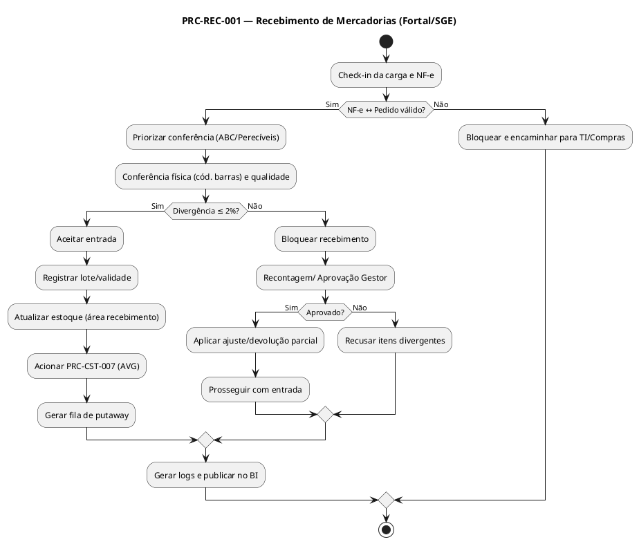

# PRC-REC-001 — Recebimento de Mercadorias

## 1. Metadados do Processo
| Campo | Descrição |
|---|---|
| **Identificador** | PRC-REC-001 |
| **Nome** | Recebimento de Mercadorias |
| **Objetivo** | Assegurar a entrada correta de produtos no SGE – Sistema de Gestão de Estoque, garantindo conformidade com documento fiscal e pedido, rastreabilidade, e atualização de saldos e custos subsequentes. |
| **Escopo** | Centro de Distribuição e Lojas Fortal (docas de recebimento e áreas de conferência). |
| **Atores** | Operador de Estoque (Conferente), Gestor de Operações, Compras, Financeiro, Auditoria Interna, TI/Administrador SGE. |
| **Gatilho** | Chegada de mercadoria com documento fiscal (NF-e) associada a um Pedido de Compra aprovado. |
| **Resultado esperado** | Produtos recebidos e conferidos; divergências tratadas; estoque atualizado; custo médio (AVG) acionado; logs de auditoria gerados. |

---

## 2. Entradas e Saídas

### 2.1 Entradas
- Documento fiscal: NF-e (XML e chave de acesso); DANFE para conferência visual.  
- Pedido de Compra: número do pedido, itens, quantidades e condições acordadas.  
- Aviso de Embarque: ASN (quando aplicável).  
- Dados de Fornecedor: cadastro ativo e condição comercial vigente.  
- Parâmetros de Qualidade: perecíveis (lote/validade, temperatura), embalagem, avarias.

### 2.2 Saídas
- Evento de recebimento registrado no SGE por item/lote/endereço provisório.  
- Relatório de divergências (quantitativas e qualitativas) com justificativa e responsáveis.  
- Atualização de estoque em área de recebimento/QA.  
- Acionamento do processo PRC-CST-007 (Atualização de Custo Médio).  
- Logs de auditoria (usuário, data/hora, ação, deltas de quantidade).  
- Notificações a Compras/Financeiro quando houver bloqueio, devolução ou bonificação.

---

## 3. Regras de Negócio Relacionadas (RN)
- RN-REC-001: Conferência obrigatória NF-e ↔ Pedido ↔ Físico antes de aceitar a entrada.  
- RN-REC-002: Tolerância de divergência quantitativa ≤ 2% por item (acima disso exige aprovação do Gestor).  
- RN-REC-003: Perecíveis exigem lote e validade; bloqueio automático se faltar dado crítico.  
- RN-ARM-001: Endereçamento provisório em área de recebimento até putaway concluído.  
- RN-CST-001: Entrada confirmada aciona cálculo AVG (custo médio) no PRC-CST-007.  
- RN-AJU-001: Divergência > tolerância deve gerar proposta de ajuste e/ou devolução parcial.  

---

## 4. Integrações e Dependências
- PDV/Backoffice (consulta de saldo e rupturas potenciais).  
- Compras/ERP (futuro): pedidos e condições comerciais; devoluções.  
- Financeiro: conciliação fiscal/financeira; retenções e impostos.  
- BI Fortal: eventos de recebimento para painéis operacionais.  
- PRC-CST-007 (Atualização de Custo Médio): dependência pós-confirmação.  
- PRC-ARM-002 (Putaway): sequência natural após aceitação do recebimento.

---

## 5. KPIs e SLAs

### 5.1 KPIs
- KPI-ACUR-01 (Acurácia de Recebimento) = Itens sem divergência / Itens recebidos ≥ 98%.  
- KPI-TMP-REC (Tempo Médio de Conferência) ≤ 15 min/carga padrão.  
- KPI-DIV-REC (Taxa de Divergência) ≤ 2% por item.  
- KPI-COMPL-DOC (Completude de Dados): % de itens com lote/validade = 100%.

### 5.2 SLAs
- SLA-REC-001: Iniciar conferência em até 30 min após atracação na doca.  
- SLA-REC-002: Encerrar o recebimento no mesmo dia para cargas padrão.  
- SLA-REC-003: Publicar evento no BI até 02:00 do dia seguinte.

---

## 6. Riscos e Mitigações
- Risco: Avarias/Perdas → Mitigação: inspeção visual + checklist de integridade.  
- Risco: Dados incompletos (lote/validade) → Mitigação: bloqueio automático e tarefa de correção.  
- Risco: Divergência acima da tolerância → Mitigação: recontagem, aprovação do Gestor e proposta de ajuste.  
- Risco: Fila/Demora na doca → Mitigação: janelas de recebimento e priorização por perecibilidade/ABC.  

---

## 7. Fluxo Detalhado (Passo a Passo — hierárquico)

### 7.1 Versão Gerencial (linguagem corporativa)
1. Preparação  
 1.1 Registrar a chegada da carga e o documento fiscal no sistema.  
 1.2 Verificar o vínculo entre o documento fiscal e o pedido de compra.  
 1.3 Priorizar conferência conforme perecibilidade e criticidade do item.  

2. Conferência  
 2.1 Realizar a conferência entre o entregue e o documento fiscal.  
 2.2 Identificar e registrar divergências com justificativas.  
 2.3 Em perecíveis, garantir o registro de lote e validade.  

3. Decisão e Tratamento  
 3.1 Se dentro da tolerância, aceitar o recebimento.  
 3.2 Se acima da tolerância, submeter à aprovação do Gestor e acionar devolução parcial.  
 3.3 Atualizar o estoque e registrar eventos de auditoria.  

4. Encerramento  
 4.1 Acionar atualização de custo médio.  
 4.2 Enviar notificações às áreas envolvidas e publicar o evento.  
 4.3 Encaminhar os itens aceitos para armazenagem.

### 7.2 Versão Técnica (linguagem logística)
1. Pré-Recebimento e Check-in  
 1.1 Atracação na doca e abertura do romaneio; captura da chave NF-e e ASN.  
 1.2 Validação tripla (NF-e ↔ Pedido ↔ Físico) no SGE/WMS.  
 1.3 Priorização por classe ABC-XYZ e perecibilidade (FEFO).  

2. Conferência Física e de Qualidade  
 2.1 Contagem por código de barras/EAN com coletor; inspeção de embalagem.  
 2.2 Perecíveis: captura de lote e validade; temperatura quando aplicável.  
 2.3 Registro de divergência e criação de task de recontagem se Δ > tolerância.  

3. Aceitação/Rejeição e Endereçamento Provisório  
 3.1 Se Δ ≤ 2%, aceitar e gerar movimentação de entrada; senão, bloquear e submeter workflow.  
 3.2 Itens aceitos recebem endereço provisório em área de recebimento/QA.  
 3.3 Geração automática de evento para PRC-CST-007 (AVG) e fila de putaway.  

4. Fechamento e Auditoria  
 4.1 Escrita de logs e anexos (XML NF-e).  
 4.2 Publicação em BI Fortal; notificação para Compras/Financeiro se devolução/bonificação.  
 4.3 Encerramento da tarefa e liberação de doca.

---

## 8. Exceções e Tratamentos
| Exceção | Condição | Tratamento | Regra |
|---|---|---|---|
| NF-e não localizada | Chave inválida/ausente | Bloqueio do recebimento; validação manual | RN-REC-001 |
| SKU sem cadastro | Item inexistente no SGE | Cadastro emergencial ou recusa | RN-REC-001 |
| Divergência > 2% | Δqtd acima da tolerância | Recontagem; aprovação Gestor; ajuste/devolução | RN-REC-002, RN-AJU-001 |
| Perecível sem lote/validade | Dado obrigatório faltante | Bloqueio e tarefa de correção; sem putaway | RN-REC-003 |
| Avaria/qualidade | Embalagem danificada | Segregar em área de quarentena; decidir descarte/devolução | RN-REC-003 |

---

## 9. Tabela de Rastreabilidade
| Artefato | Relação |
|---|---|
| RF-REC-001, RF-REC-002, RF-REC-003, RF-CST-001 | Implementam as funções de registrar recebimento, conferir, registrar divergências e acionar custo médio. |
| RN-REC-001/002/003; RN-AJU-001; RN-CST-001 | Regras que condicionam aceitação, tolerâncias, dados obrigatórios e cálculo AVG. |
| KPIs: KPI-ACUR-01, KPI-TMP-REC, KPI-DIV-REC, KPI-COMPL-DOC | Avaliam desempenho do processo. |
| Integrações: PDV, Compras/ERP (futuro), BI Fortal | Consumo/produção de eventos e dados. |

---

## 10. PlantUML (visão textual do fluxo)

