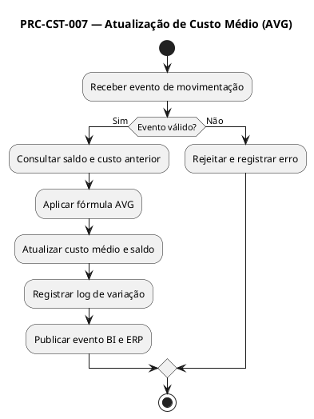

# PRC-CST-007 — Atualização de Custo Médio (AVG)

## 1. Metadados do Processo
| Campo | Descrição |
|---|---|
| **Identificador** | PRC-CST-007 |
| **Nome** | Atualização de Custo Médio (AVG) |
| **Objetivo** | Garantir o cálculo e a atualização precisa do custo médio ponderado dos produtos no SGE, refletindo movimentações de entrada e saída e assegurando consistência contábil e gerencial. |
| **Escopo** | Estoques do Supermercado Fortal — todos os centros de armazenamento e categorias de produtos. |
| **Atores** | Operador de Estoque, Gestor de Operações, Controladoria, Financeiro, Auditoria Interna, TI/Administrador do SGE. |
| **Gatilho** | Registro de movimentação de entrada (recebimento) ou saída (expedição, ajuste) confirmada. |
| **Resultado Esperado** | Custo médio atualizado em tempo real; valores anteriores preservados para auditoria; relatórios consolidados de variação de custo. |

---

## 2. Entradas e Saídas

### 2.1 Entradas
- Movimentações confirmadas (entradas e saídas) com quantidades e valores unitários.  
- Custo médio anterior armazenado no banco de dados.  
- Dados de produtos (SKU, categoria, unidade de medida).  
- Logs de auditoria das operações.  
- Eventos originados de PRC-REC-001 (recebimento) e PRC-AJU-005 (ajustes de estoque).

### 2.2 Saídas
- Novo valor de custo médio ponderado (AVG) por SKU.  
- Registro histórico de cálculo e auditoria (antes/depois).  
- Geração de relatório de variação de custo.  
- Integração com BI Fortal e Controladoria.  
- Atualização de saldos contábeis e log de auditoria permanente.

---

## 3. Regras de Negócio Relacionadas (RN)
- RN-CST-001: O custo médio ponderado deve ser recalculado a cada nova entrada ou saída que altere o valor total do estoque.  
- RN-CST-002: Movimentações de ajuste aprovadas também alteram o custo médio.  
- RN-AJU-004: Logs de custo devem conter usuário, timestamp e valor anterior/posterior.  
- RN-REC-001: Entradas de recebimento disparam o cálculo de custo médio.  
- RN-INV-010: Inventários não alteram custo médio, apenas saldos físicos.  

---

## 4. Integrações e Dependências
- PRC-REC-001 (Recebimento de Mercadorias) — entrada de produtos.  
- PRC-AJU-005 (Ajustes de Estoque) — correções e variações contábeis.  
- Financeiro/ERP (futuro) — conciliação de custo e contas de estoque.  
- BI Fortal — relatórios consolidados de variação de custo e margem.  
- Auditoria Interna — rastreabilidade de alterações e logs.  

---

## 5. Fórmula de Cálculo do Custo Médio (AVG)

\[
\text{Novo Custo Médio} = \frac{(Custo\_Anterior × Quantidade\_Anterior) + (Custo\_Entrada × Quantidade\_Entrada)}{Quantidade\_Anterior + Quantidade\_Entrada}
\]

**Condições especiais:**
- Se houver saída, o custo médio permanece inalterado, mas é usado para valorização da baixa.  
- Se o produto estiver sem saldo anterior, o novo custo médio = custo da primeira entrada.  
- O cálculo é realizado em transação atômica com rollback automático em caso de falha.

---

## 6. KPIs e SLAs

### 6.1 KPIs
- KPI-CUST-01 (Precisão do Cálculo AVG) ≥ 99,9%.  
- KPI-CUST-02 (Tempo de Processamento AVG) ≤ 1s por transação.  
- KPI-CUST-03 (Integridade Contábil) = divergência entre SGE e Financeiro ≤ 0,01%.  

### 6.2 SLAs
- SLA-CST-001: Atualizar custo médio em até 5 segundos após o evento de entrada.  
- SLA-CST-002: Disponibilizar relatórios de variação de custo em tempo real para BI.  
- SLA-CST-003: Garantir disponibilidade 24x7 do módulo de cálculo de custo.  

---

## 7. Riscos e Mitigações
| Risco | Impacto | Mitigação |
|---|---|---|
| Erro de arredondamento | Distorsão no valor contábil | Usar precisão decimal de 6 casas e controle de auditoria. |
| Cálculo duplicado | Custo incorreto | Trava lógica (flag de evento processado). |
| Falha em integração com ERP | Divergência de valores contábeis | Reprocessamento automático e log de falha. |
| Alteração manual indevida | Risco de fraude | Bloqueio de edição e controle de perfil no SGE. |

---

## 8. Fluxo Detalhado (Passo a Passo — hierárquico)

### 8.1 Versão Gerencial
1. Preparação  
 1.1 Receber a informação de movimentação validada.  
 1.2 Verificar se há saldo anterior e custo médio vigente.  
 1.3 Reunir dados financeiros e contábeis relacionados.  

2. Cálculo e Atualização  
 2.1 Aplicar fórmula de custo médio ponderado (AVG).  
 2.2 Atualizar o custo do produto em estoque.  
 2.3 Registrar o histórico de variação e manter valor anterior para auditoria.  

3. Integração e Comunicação  
 3.1 Enviar dados ao BI e Controladoria.  
 3.2 Gerar relatório de variação de custo.  
 3.3 Encerrar transação e liberar o evento.  

### 8.2 Versão Técnica (Logística / Contábil)
1. Trigger e Coleta de Dados  
 1.1 Evento “Entrada Confirmada” recebido do PRC-REC-001 via API interna.  
 1.2 Consulta de saldo atual (quantidade e custo) na tabela `TB_ESTOQUE`.  
 1.3 Obtenção de `Custo_Entrada`, `Qtde_Entrada` e `Qtde_Anterior`.  

2. Execução do Cálculo  
 2.1 Aplicar a fórmula AVG com precisão de 6 decimais.  
 2.2 Atualizar `TB_ESTOQUE.CUSTO_MEDIO` e `TB_ESTOQUE.QTDE`.  
 2.3 Criar registro em `TB_LOG_CUSTO` com `ID_SKU`, valores antigos e novos, data e usuário.  

3. Integração Pós-Cálculo  
 3.1 Enviar evento para módulo `BI_CUSTO`.  
 3.2 Sincronizar com ERP (quando ativo).  
 3.3 Gerar log de conclusão no `TB_AUDITORIA_EVENTOS`.  

---

## 9. Exceções e Tratamentos
| Exceção | Condição | Tratamento | Regra |
|---|---|---|---|
| Movimentação sem valor unitário | Campo de custo nulo | Bloquear atualização e registrar erro | RN-CST-001 |
| Quantidade negativa | Erro sistêmico ou ajuste indevido | Rejeitar transação e acionar TI | RN-AJU-004 |
| Falha de conexão BI | Timeout na integração | Retry automático (3x) | RN-CST-002 |
| Divergência contábil > 0,01% | Diferença entre SGE e ERP | Notificar Controladoria | RN-CST-002 |

---

## 10. Tabela de Rastreabilidade
| Artefato | Relação |
|---|---|
| RF-CST-001, RF-CST-002, RF-CST-003 | Implementam o cálculo e atualização do custo médio. |
| RN-CST-001/002, RN-AJU-004 | Definem critérios e logs obrigatórios. |
| KPIs: KPI-CUST-01, KPI-CUST-02, KPI-CUST-03 | Medem precisão, tempo e integridade contábil. |
| Integrações: PRC-REC-001, PRC-AJU-005, BI Fortal, ERP | Consumo e publicação de eventos. |

---

## 11. PlantUML (visão textual)

