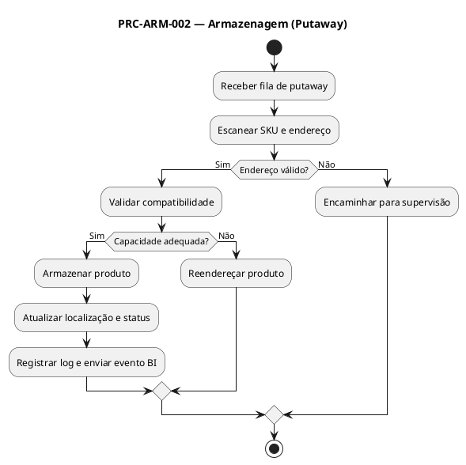

# PRC-ARM-002 — Armazenagem (Putaway)

## 1. Metadados do Processo
| Campo | Descrição |
|---|---|
| **Identificador** | PRC-ARM-002 |
| **Nome** | Armazenagem (Putaway) |
| **Objetivo** | Garantir a alocação correta e otimizada dos produtos recebidos nos endereços físicos do armazém, respeitando critérios de classe ABC-XYZ, perecibilidade, compatibilidade e segurança operacional. |
| **Escopo** | Áreas de recebimento, armazenagem e picking do Supermercado Fortal (CD e lojas). |
| **Atores** | Operador de Estoque, Gestor de Armazém, Planejador Logístico, TI/Administrador do SGE. |
| **Gatilho** | Conclusão do processo PRC-REC-001 (Recebimento de Mercadorias) e geração de fila de Putaway. |
| **Resultado Esperado** | Produtos armazenados corretamente, rastreáveis por endereço e disponíveis para consulta, separação ou inventário. |

---

## 2. Entradas e Saídas

### 2.1 Entradas
- Fila de Putaway gerada automaticamente pelo processo de Recebimento.  
- Parâmetros de endereçamento (zona, corredor, nível, posição).  
- Dados do produto: SKU, categoria, classe ABC-XYZ, lote e validade (para perecíveis).  
- Mapas de capacidade de endereços e restrições de compatibilidade (peso, volume, tipo).  

### 2.2 Saídas
- Registro do produto no endereço final (TB_ENDERECAMENTO).  
- Atualização do status do item para “Armazenado”.  
- Log de movimentação interna no SGE.  
- Atualização de disponibilidade para processos subsequentes (expedição, inventário).  
- Relatórios de ocupação e eficiência de armazenagem.  

---

## 3. Regras de Negócio Relacionadas (RN)
- RN-ARM-001: Nenhum item pode ser armazenado sem endereço validado.  
- RN-ARM-002: Priorizar armazenagem por proximidade de giro (classe ABC).  
- RN-ARM-003: Perecíveis seguem política FEFO (First Expire, First Out).  
- RN-ARM-004: Respeitar capacidade volumétrica e peso máximo do endereço.  
- RN-ARM-005: Endereços devem estar ativos e sem bloqueio.  
- RN-ARM-006: Operações de putaway devem ser registradas com timestamp e usuário.  

---

## 4. Integrações e Dependências
- PRC-REC-001 — fornece os itens aceitos para armazenagem.  
- PRC-CST-007 — fornece custo médio atualizado.  
- PRC-INV-004 — utiliza dados de endereço para inventários.  
- PRC-MOV-003 — consome endereços para picking/expedição.  
- BI Fortal — gera relatórios de ocupação e eficiência.  
- Módulo de Segurança (TI) — controla acesso a zonas restritas.  

---

## 5. KPIs e SLAs

### 5.1 KPIs
- KPI-GIRO-01 (Eficiência de Endereçamento) = Itens armazenados corretamente / total de itens processados ≥ 98%.  
- KPI-TMP-ARM (Tempo Médio de Putaway) ≤ 20 min/carga padrão.  
- KPI-UTIL-ARM (Utilização de Capacidade) = % de endereços ocupados / total ≤ 85%.  
- KPI-ERR-LOC (Taxa de Endereçamento Incorreto) ≤ 1%.  

### 5.2 SLAs
- SLA-ARM-001: Iniciar putaway em até 1 hora após o recebimento.  
- SLA-ARM-002: Concluir armazenagem no mesmo dia da conferência.  
- SLA-ARM-003: Garantir rastreabilidade imediata no SGE após confirmação.  

---

## 6. Riscos e Mitigações
| Risco | Impacto | Mitigação |
|---|---|---|
| Endereçamento incorreto | Perda de rastreabilidade | Validação dupla com código de barras. |
| Superlotação de zonas | Ineficiência operacional | Monitorar ocupação e redistribuir via BI. |
| Produtos bloqueados armazenados | Erro de qualidade | Bloqueio lógico no SGE antes do putaway. |
| Falha na leitura de código | Interrupção de fluxo | Releitura e fallback manual. |

---

## 7. Fluxo Detalhado (Passo a Passo — hierárquico)

### 7.1 Versão Gerencial
1. Planejamento  
 1.1 Receber a lista de produtos liberados para armazenagem.  
 1.2 Verificar prioridades de alocação (giro, validade, categoria).  
 1.3 Designar operadores e rotas de armazenagem.  

2. Execução  
 2.1 Armazenar os produtos conforme endereços disponíveis e seguros.  
 2.2 Garantir que o registro de localização esteja completo e validado.  
 2.3 Monitorar ocupação e desempenho em tempo real via painel de BI.  

3. Fechamento  
 3.1 Validar armazenagem com dupla checagem.  
 3.2 Encerrar a tarefa no sistema e liberar o operador.  
 3.3 Atualizar dashboards de eficiência e ocupação.  

### 7.2 Versão Técnica (Logística)
1. Geração e Leitura de Fila  
 1.1 Sistema gera automaticamente TB_PUTAWAY_TASKS a partir do PRC-REC-001.  
 1.2 Operador escaneia código de barras do SKU e do endereço.  
 1.3 O SGE valida a compatibilidade (peso, tipo, zona).  

2. Armazenagem Física  
 2.1 Operador desloca o produto até o endereço.  
 2.2 Sistema registra timestamp de entrada.  
 2.3 Caso o endereço esteja ocupado, reatribui automaticamente outro local.  

3. Finalização  
 3.1 O sistema atualiza TB_ESTOQUE.LOCALIZACAO e status = “Armazenado”.  
 3.2 Logs gravados em TB_LOG_MOV_INT.  
 3.3 BI Fortal recebe o evento via API REST POST /estoque/putaway.  

---

## 8. Exceções e Tratamentos
| Exceção | Condição | Tratamento | Regra |
|---|---|---|---|
| Endereço inválido | Código não cadastrado ou bloqueado | Substituir endereço via supervisão | RN-ARM-005 |
| Incompatibilidade peso/volume | Excede capacidade | Reendereçar automaticamente | RN-ARM-004 |
| Falha de leitura | Scanner sem resposta | Releitura ou registro manual | RN-ARM-006 |
| Produto bloqueado | QA pendente | Segregar em zona de quarentena | RN-ARM-001 |

---

## 9. Tabela de Rastreabilidade
| Artefato | Relação |
|---|---|
| RF-ARM-001, RF-ARM-002, RF-ARM-003 | Implementam o controle de endereçamento e rastreabilidade. |
| RN-ARM-001–006 | Regras operacionais e de validação. |
| KPIs: KPI-GIRO-01, KPI-TMP-ARM, KPI-UTIL-ARM | Medem eficiência e ocupação. |
| Integrações: PRC-REC-001, BI Fortal | Geração e consumo de eventos. |

---

## 10. PlantUML (visão textual)

