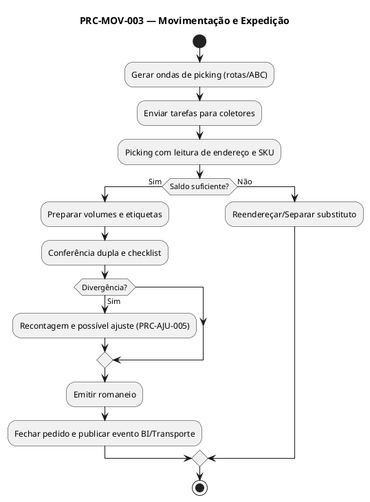

# PRC-MOV-003 — Movimentação e Expedição

## 1. Metadados do Processo
| Campo | Descrição |
|---|---|
| **Identificador** | PRC-MOV-003 |
| **Nome** | Movimentação e Expedição |
| **Objetivo** | Assegurar a separação, conferência e saída de produtos com exatidão e dentro dos prazos, garantindo rastreabilidade ponta a ponta, conformidade comercial e satisfação do cliente. |
| **Escopo** | Áreas de picking, conferência e docas de expedição (CD e lojas Fortal). |
| **Atores** | Operador de Picking, Conferente, Gestor de Operações, Transporte/Logística, TI/Administrador do SGE, Auditoria Interna. |
| **Gatilho** | Pedido de venda/transferência aprovado e liberado para separação; ordem de expedição gerada. |
| **Resultado Esperado** | Pedido separado, conferido, embalado, etiquetado e expedido; atualização de saldos e geração de documentos/logs. |

---

## 2. Entradas e Saídas

### 2.1 Entradas
- **Pedidos**: venda, transferência, reposição entre lojas.  
- **Parâmetros de priorização**: classe ABC-XYZ, SLAs de entrega, perecibilidade, rota.  
- **Endereços e saldos**: posições de estoque (origem), lotes/validades.  
- **Recursos**: operadores, equipamentos, embalagens, etiquetas.  

### 2.2 Saídas
- Pedido separado e **confirmado** no SGE.  
- **Romaneio de carga** e etiquetas (pedido, volumes, rota).  
- Atualização de estoque por endereço e lote (baixa).  
- **Bloqueios** e notificações quando houver inconformidades.  
- **Logs de auditoria** e eventos para BI Fortal.  

---

## 3. Regras de Negócio Relacionadas (RN)
- **RN-EXP-001**: Picking deve respeitar estratégia por rota e classe ABC-XYZ.  
- **RN-EXP-002**: Perecíveis utilizam **FEFO** (primeiro que vence, sai primeiro).  
- **RN-EXP-003**: Conferência **dupla** obrigatória para itens de alto valor.  
- **RN-EXP-004**: Divergência no picking exige recontagem e aprovação do Gestor.  
- **RN-EXP-007**: **Bloquear expedição** para itens vencidos ou vencendo no mesmo dia.  
- **RN-EXP-008**: Validação final antes da saída da doca (checklist).  
- **RN-EXP-009**: Geração automática de tarefas de picking otimizadas (ondas/rotas).  

---

## 4. Integrações e Dependências
- **PRC-ARM-002 (Putaway)** — fornece endereços e saldos consolidados.  
- **PRC-INV-004 (Inventário)** — bloqueios temporários durante contagem.  
- **PRC-AJU-005 (Ajustes)** — regulariza divergências de separação.  
- **PDV/OMS/ERP (futuro)** — origem de pedidos e faturamento.  
- **BI Fortal** — indicadores de OTIF, produtividade e erros.  
- **Transporte** — janelas de coleta e roteirização.  

---

## 5. KPIs e SLAs

### 5.1 KPIs
- **KPI-OTIF-01 (On Time In Full)** ≥ **98%**.  
- **KPI-TMP-PICK (Tempo Médio de Picking)** ≤ **10 min/pedido padrão**.  
- **KPI-ERRO-PICK (Taxa de Erros de Picking)** ≤ **0,8%**.  
- **KPI-DIV-EXP (Divergência de Expedição)** ≤ **1%**.  

### 5.2 SLAs
- **SLA-EXP-001**: Iniciar picking até **15 min** após liberação do pedido.  
- **SLA-EXP-002**: Concluir conferência até **10 min** após fim do picking.  
- **SLA-EXP-003**: Romaneio final emitido antes da janela de transporte.  

---

## 6. Riscos e Mitigações
| Risco | Impacto | Mitigação |
|---|---|---|
| Endereço esgotado durante picking | Atraso/ruptura | Reendereçar automático; sinalizar Compras/Reabastecimento. |
| Expedição de item vencido | Perda e sanção | Regra FEFO e bloqueio de validade (RN-EXP-007). |
| Erro de separação | Devolução/retrabalho | Conferência dupla e código de barras por item/endereço. |
| Atraso em janela de transporte | OTIF reduzido | Alertas de SLA e roteirização dinâmica. |

---

## 7. Fluxo Detalhado (Passo a Passo — hierárquico)

### 7.1 Versão **Gerencial** (linguagem corporativa)
1. Planejamento e Liberação  
 1.1 Priorizar pedidos conforme prazos e criticidade dos itens.  
 1.2 Liberar ordens de separação e designar equipes/recursos.  
 1.3 Acompanhar indicadores de progresso e gargalos.  

2. Execução do Picking  
 2.1 Realizar a separação dos itens seguindo a rota definida.  
 2.2 Registrar a conclusão do picking e preparar volumes.  
 2.3 Encaminhar para conferência e embalagem.  

3. Conferência e Expedição  
 3.1 Conferir itens, quantidades e condições (qualidade/validade).  
 3.2 Resolver divergências com recontagem e, se necessário, ajuste.  
 3.3 Emitir romaneio e liberar a carga dentro da janela de transporte.  

### 7.2 Versão **Técnica** (logística operacional)
1. Geração de Tarefas e Roteirização  
 1.1 Criar **ondas de picking** (wave picking) por rota/ABC no SGE.  
 1.2 Enviar **tarefas** para coletores: SKU, endereço, lote, unidade.  
 1.3 Aplicar **política FEFO** para perecíveis e prioridade de classe A.  

2. Execução do Picking e Embalagem  
 2.1 Operador escaneia **endereço** e **SKU** (validação cruzada).  
 2.2 Baixar saldo por lote/endereço (**mov. de saída**).  
 2.3 Preparar **volumes** com **etiquetas** (pedido, volume, rota).  

3. Conferência e Saída de Doca  
 3.1 **Conferência dupla**: reescaneio e checklist de qualidade.  
 3.2 Se **Δ > 0**: gerar **tarefa de recontagem** e acionar **PRC-AJU-005** se necessário.  
 3.3 Emitir **romaneio**, **fechar pedido** e **gerar evento BI**/**transporte**.  

---

## 8. Exceções e Tratamentos
| Exceção | Condição | Tratamento | Regra |
|---|---|---|---|
| Endereço sem saldo | Picking não encontra quantidade | Reendereçar e/ou separar substituto | RN-EXP-001 |
| Item vencido ou sem validade | Perecível com data inválida | Bloquear expedição | RN-EXP-007 |
| Erro de leitura | Falha de scanner | Releitura/backup manual | RN-EXP-003 |
| Divergência de quantidade | Δ entre picking e pedido | Recontagem e aprovação do Gestor | RN-EXP-004 |

---

## 9. Tabela de Rastreabilidade
| Artefato | Relação |
|---|---|
| **RF-MOV-001, RF-MOV-002, RF-EXP-001** | Implementam picking, conferência e expedição. |
| **RN-EXP-001/002/003/004/007/008/009** | Parametrizam prioridade, FEFO, conferência e bloqueios. |
| **KPIs: KPI-OTIF-01, KPI-TMP-PICK, KPI-ERRO-PICK** | Medem pontualidade, produtividade e acurácia. |
| **Integrações: PRC-ARM-002, PRC-AJU-005, BI, Transporte** | Alimentam e consomem eventos do processo. |

---

## 10. PlantUML (visão textual)

