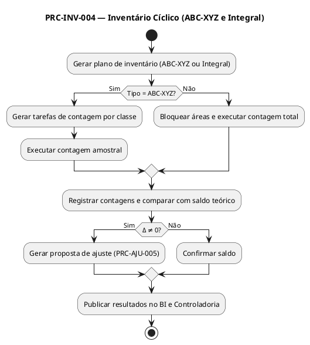

# PRC-INV-004 — Inventário Cíclico

## 1. Metadados do Processo
| Campo | Descrição |
|---|---|
| **Identificador** | PRC-INV-004 |
| **Nome** | Inventário Cíclico |
| **Objetivo** | Assegurar a precisão dos saldos de estoque físico e sistêmico no SGE Fortal, utilizando políticas de contagem rotativa contínua (ABC-XYZ) ou integral, garantindo rastreabilidade, confiabilidade contábil e suporte à tomada de decisão. |
| **Escopo** | Todas as áreas de armazenagem e endereços ativos do Supermercado Fortal (CD e lojas). |
| **Atores** | Operador de Inventário, Conferente, Gestor de Operações, Controladoria, Auditoria Interna, TI/Administrador do SGE. |
| **Gatilho** | Agendamento periódico de contagem (diária, semanal, mensal, semestral ou anual). |
| **Resultado Esperado** | Divergências identificadas, justificadas e ajustadas; relatórios consolidados e acurácia de estoque ≥ 98%. |

---

## 2. Entradas e Saídas

### 2.1 Entradas
- Plano de inventário (rotativo ou integral).  
- Saldos sistêmicos de estoque (`TB_ESTOQUE`).  
- Classificação de itens (ABC-XYZ).  
- Endereços ativos e status.  
- Dados de auditoria e logs de movimentação.  

### 2.2 Saídas
- Registros de contagem física (`TB_CONTAGEM`).  
- Relatórios de divergências e ajustes.  
- Atualização de saldos e geração de logs de auditoria.  
- Indicadores de acurácia e produtividade.  
- Publicação de resultados no BI Fortal e Controladoria.  

---

## 3. Opção A — Política ABC-XYZ (Amostragem Estratificada)

### 3.1 Descrição
A contagem é realizada de forma rotativa conforme a criticidade e o giro dos itens.  
| Classe | Critério | Frequência | Profundidade |
|---|---|---|---|
| **A** | Alto valor / alto giro | Diária / Semanal | 100% dos endereços |
| **B** | Médio valor / médio giro | Quinzenal | 50% dos endereços |
| **C** | Baixo valor / baixo giro | Mensal / Bimestral | 25% dos endereços |

**Vantagem:** otimiza recursos e prioriza os itens críticos.  
**Risco:** itens de menor giro podem ficar mais tempo sem validação.  

### 3.2 Narrativa Gerencial
O Gestor de Operações elabora o plano de inventário cíclico baseado na classificação ABC-XYZ. O SGE agenda automaticamente as contagens e notifica as equipes responsáveis. As divergências são consolidadas e analisadas pela Controladoria e Auditoria.  

### 3.3 Narrativa Técnica (SGE/WMS)
O módulo `INV_ROTATIVO` gera a fila `TB_INV_TASKS` a partir de `TB_CLASSIFICACAO_ABC` e `TB_CLASSIFICACAO_XYZ`. Cada tarefa contém SKU, endereço e faixa de amostragem. A execução ocorre via coletor de dados com leitura de código de barras. O sistema compara o valor físico e teórico (`Δ = físico − teórico`) e envia as divergências ao processo **PRC-AJU-005**.  

---

## 4. Opção B — Política Integral (100%)

### 4.1 Descrição
A contagem é executada de forma completa em todas as áreas e endereços, geralmente com parada operacional programada.  

**Vantagem:** máxima confiabilidade física e contábil.  
**Risco:** necessidade de bloqueio operacional temporário.  

### 4.2 Narrativa Gerencial
A Controladoria e o Gestor de Operações coordenam o inventário total do armazém. Durante a contagem, as áreas são bloqueadas no SGE e liberadas após validação. Divergências são tratadas e justificadas com o apoio da Auditoria Interna.  

### 4.3 Narrativa Técnica (SGE/WMS)
O módulo `INV_TOTAL` bloqueia transações de movimentação (`LOCK_AREA`). Os coletores realizam dupla contagem (operador e conferente). O sistema grava o resultado em `TB_CONTAGEM_TOTAL`, calcula o delta (`Δ = físico − teórico`) e gera proposta de ajuste (`PRC-AJU-005`). Os logs são registrados em `TB_LOG_INV` com timestamp, usuário e resultado.  

---

## 5. Regras de Negócio Relacionadas (RN)
- **RN-INV-001**: Todo endereço ativo deve possuir saldo físico e sistêmico conciliado.  
- **RN-INV-002**: Itens perecíveis devem ser contados com lote e validade.  
- **RN-INV-003**: Divergências > 2% exigem auditoria e justificativa formal.  
- **RN-INV-004**: Inventário não altera custo médio, apenas saldo físico.  
- **RN-INV-005**: Contagens devem ocorrer fora do horário de pico operacional.  
- **RN-INV-006**: Áreas em contagem devem estar bloqueadas para movimentação.  

---

## 6. KPIs e SLAs

### 6.1 KPIs
- **KPI-INV-ACUR (Acurácia de Estoque)** ≥ **98%**.  
- **KPI-INV-TMP (Tempo Médio de Contagem)** ≤ **20 min/área**.  
- **KPI-INV-DIV (Taxa de Divergência)** ≤ **2%**.  
- **KPI-INV-AJU (Divergência Ajustada)** ≤ **1%**.  

### 6.2 SLAs
- **SLA-INV-001**: Concluir contagem e registrar resultados **no mesmo dia**.  
- **SLA-INV-002**: Corrigir divergências em até **24 horas**.  
- **SLA-INV-003**: Publicar indicadores no **BI Fortal** em até **1 hora** após fechamento.  

---

## 7. Riscos e Mitigações
| Risco | Impacto | Mitigação |
|---|---|---|
| Parada operacional prolongada | Atraso em pedidos | Agendamento fora do horário comercial |
| Falha de leitura | Divergência de registro | Leitura dupla e validação cruzada |
| Erro humano de contagem | Divergência física/sistêmica | Dupla conferência e checklist digital |
| Inconsistência de dados | Relatórios incorretos | Bloqueio de área e recontagem automatizada |

---

## 8. Exceções e Tratamentos
| Exceção | Condição | Tratamento | Regra |
|---|---|---|---|
| Endereço bloqueado incorretamente | Erro de configuração | Desbloqueio via TI | RN-INV-006 |
| Item sem cadastro | SKU inexistente | Cadastro emergencial | RN-INV-001 |
| Divergência acima de 5% | Falha grave | Acionar Auditoria Interna | RN-INV-003 |
| Contagem duplicada | Task repetida | Cancelamento automático | RN-INV-005 |

---

## 9. Tabela de Rastreabilidade
| Artefato | Relação |
|---|---|
| **RF-INV-001, RF-INV-002, RF-INV-003** | Implementam contagem cíclica e total. |
| **RN-INV-001–006** | Parametrizam execução, bloqueio e auditoria. |
| **KPIs: KPI-INV-ACUR, KPI-INV-TMP, KPI-INV-AJU** | Medem precisão e eficiência. |
| **Integrações: PRC-AJU-005, BI Fortal, ERP** | Consumo e publicação de eventos. |

---

## 10. PlantUML (Fluxo Unificado)

