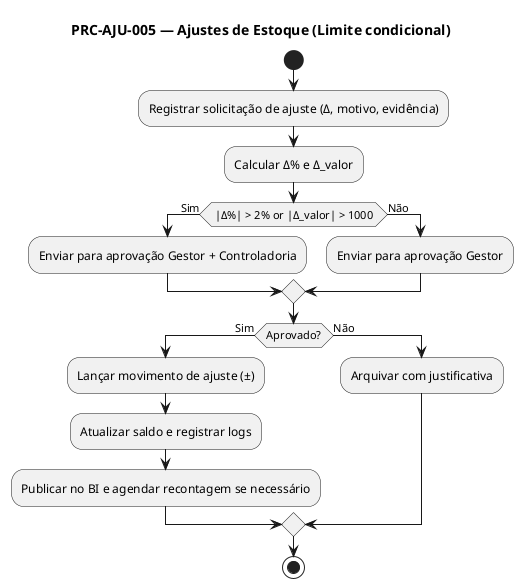

# PRC-AJU-005 — Ajustes de Estoque

## 1. Metadados do Processo
| Campo | Descrição |
|---|---|
| **Identificador** | PRC-AJU-005 |
| **Nome** | Ajustes de Estoque |
| **Objetivo** | Corrigir saldos de estoque sistêmicos frente a diferenças físicas, erros operacionais, perdas, avarias ou regularizações, garantindo **rastreabilidade, aprovação hierárquica condicional** e conformidade contábil. |
| **Escopo** | Todas as áreas de armazenagem do Supermercado Fortal (CD e lojas) e todos os tipos de itens (perecíveis e não perecíveis). |
| **Atores** | Operador de Estoque, Conferente/Inventariante, Gestor de Operações, Controladoria (aprovação), Auditoria Interna, TI/Administrador SGE. |
| **Gatilhos** | Divergências oriundas de **PRC-INV-004 (Inventário)**, **PRC-REC-001 (Recebimento)**, **PRC-MOV-003 (Expedição)**, auditorias de rotina ou incidentes. |
| **Resultado Esperado** | Ajustes corretamente lançados, **aprovados quando acima de limite**, refletidos no saldo, com **logs imutáveis** e comunicação aos módulos dependentes (BI, Contábil). |

---

## 2. Entradas e Saídas

### 2.1 Entradas
- Solicitação de ajuste contendo: SKU, endereço, lote/validade (se aplicável), **Δ (delta) quantidade**, motivo, evidências (foto, checklist), responsável e origem (processo).  
- Saldos atuais por endereço (`TB_ESTOQUE`).  
- Parâmetros de aprovação (`LIMITE_PERC = ±2%` **ou** `LIMITE_VALOR = ±R$ 1.000,00`).  
- Perfis autorizados e matriz de alçadas (papéis SGE).

### 2.2 Saídas
- Lançamento de ajuste (positivo/negativo) com novo saldo.  
- Registro de **workflow de aprovação** quando aplicável.  
- Logs de auditoria (`TB_LOG_AJUSTE`), incluindo antes/depois, usuário, timestamp.  
- Notificações para Controladoria e BI Fortal.  
- Gatilho opcional para **PRC-CST-007** quando a política contábil assim determinar (ex.: ajustes de custo por reprocesso — por padrão, **não altera AVG**, somente saldo).

---

## 3. Regras de Negócio Relacionadas (RN)
- **RN-AJU-001**: Todo ajuste deve ter **motivo** classificado (perda, avaria, erro de lançamento, sobra, roubo, inventário).  
- **RN-AJU-002**: É **obrigatória** a anexação de **evidências** para ajustes negativos acima de 0,5% do estoque do endereço.  
- **RN-AJU-003**: Campos obrigatórios para perecíveis: **lote** e **validade**.  
- **RN-AJU-004**: **Dupla aprovação (Gestor + Controladoria)** é exigida **apenas quando** `|Δ%| > 2%` **ou** `|Δ Valor| > R$ 1.000,00`. Abaixo do limite, aprovação somente do **Gestor**.  
- **RN-AJU-005**: Ajustes não **alteram custo médio (AVG)** por padrão; afetam apenas saldo físico. Exceções devem ser aprovadas pela Controladoria.  
- **RN-AJU-006**: Ajustes em itens **bloqueados** (qualidade/quarentena) exigem liberação prévia.  
- **RN-AJU-007**: Todos os ajustes gravam **log imutável** com dados anteriores e posteriores.  

---

## 4. Integrações e Dependências
- **PRC-INV-004 — Inventário Cíclico** (origem de divergências).  
- **PRC-REC-001 — Recebimento** (divergências de conferência).  
- **PRC-MOV-003 — Movimentação/Expedição** (erros de picking e conferência).  
- **PRC-CST-007 — Custo Médio** (somente quando regra contábil assim definir).  
- **BI Fortal** (indicadores e painéis de perdas).  
- **ERP/Financeiro (futuro)** (reconciliação contábil).  

---

## 5. KPIs e SLAs

### 5.1 KPIs
- **KPI-AJU-01 (Tempo de Ciclo do Ajuste)** ≤ **4 horas** (solicitação → conclusão).  
- **KPI-AJU-02 (Taxa de Ajustes com Evidência)** ≥ **95%** (para Δ negativos > 0,5%).  
- **KPI-AJU-03 (Recorrência por SKU/Endereço)** ≤ **1 ajuste/mês** (por SKU/endereço).  
- **KPI-AJU-04 (Acurácia Pós-Ajuste)** ≥ **99%** no endereço ajustado.  

### 5.2 SLAs
- **SLA-AJU-001**: Aprovar ou reprovar ajustes **em até 2 horas** quando em janela operacional.  
- **SLA-AJU-002**: Publicar ajuste no BI **em até 15 min** após conclusão.  
- **SLA-AJU-003**: Recontagem obrigatória **em até 24 horas** para ajustes > 2%.  

---

## 6. Riscos e Mitigações
| Risco | Impacto | Mitigação |
|---|---|---|
| Ajuste sem evidência | Fraude/erro | Validação automática e bloqueio até anexar prova. |
| Volume alto de ajustes | Processos falhos | Análise de causa raiz e plano corretivo. |
| Aprovação pendente | Parada operacional | Alertas escalonados (SLA) e substituição de aprovador. |
| Ajuste em item perecível sem lote | Perda de rastreabilidade | Bloqueio e exigência de dados críticos. |

---

## 7. Fluxo Detalhado (Passo a Passo — hierárquico)

### 7.1 Versão **Gerencial** (linguagem corporativa)
1. Registro da Solicitação  
 1.1 Descrever a diferença encontrada (quantidade, valor estimado, motivo).  
 1.2 Anexar evidências (quando aplicável) e indicar o processo de origem.  
 1.3 Enviar para validação do Gestor.  

2. Validação e Aprovação  
 2.1 O Gestor verifica consistência e impacto.  
 2.2 Se o ajuste **ultrapassar os limites** (±2% ou ±R$ 1.000,00), envia para **Controladoria**.  
 2.3 Aprovar ou reprovar; comunicar decisão ao solicitante.  

3. Lançamento e Encerramento  
 3.1 Lançar o ajuste no SGE; atualizar saldos.  
 3.2 Gerar logs e publicar no BI.  
 3.3 Programar recontagem (quando aplicável) e encerrar o caso.  

### 7.2 Versão **Técnica** (logística/SGE)
1. Coleta e Pré-Validação  
 1.1 Criar **`TB_AJUSTES_SOLIC`** com SKU, endereço, lote, Δ, motivo, anexos.  
 1.2 Calcular `Δ% = Δ / saldo_teorico` e `Δ_valor = Δ × custo_medio`.  
 1.3 Classificar `Nível_Aprovação = GESTOR` **ou** `GESTOR+CONTROLADORIA` conforme limites.  

2. Workflow de Aprovação  
 2.1 Rotina de SLA envia **alertas** a cada 30 min até decisão.  
 2.2 Decisão gravada em **`TB_AJUSTES_APROVACAO`** com usuário/timestamp.  
 2.3 Se reprovado, **encerrar** e arquivar com justificativa.  

3. Lançamento no Estoque e Fechamento  
 3.1 Gravar movimento em **`TB_MOV_AJUSTE`** (positivo/negativo).  
 3.2 Atualizar `TB_ESTOQUE.QTDE` e manter `CUSTO_MEDIO` (por padrão).  
 3.3 Registrar log imutável em **`TB_LOG_AJUSTE`** e publicar evento no **BI**.  

---

## 8. Exceções e Tratamentos
| Exceção | Condição | Tratamento | Regra |
|---|---|---|---|
| Solicitação sem motivo | Campo obrigatório vazio | Bloqueio da submissão | RN-AJU-001 |
| Falta de evidência (Δ− > 0,5%) | Exigência de prova | Bloqueio até anexar | RN-AJU-002 |
| Item perecível sem lote/validade | Dado crítico ausente | Bloqueio e correção | RN-AJU-003 |
| Limite excedido sem Controladoria | Falha de alçada | Encaminhar para aprovação complementar | RN-AJU-004 |

---

## 9. Tabela de Rastreabilidade
| Artefato | Relação |
|---|---|
| **RF-AJU-001, RF-AJU-002, RF-AJU-003** | Implementam solicitação, aprovação e lançamento de ajustes. |
| **RN-AJU-001–007** | Definem motivos, evidências, alçadas, logs e exceções. |
| **KPIs: KPI-AJU-01..04** | Medem velocidade, conformidade e recorrência. |
| **Integrações: PRC-INV-004, PRC-REC-001, PRC-MOV-003, BI, ERP** | Consumo e publicação de eventos. |

---

## 10. PlantUML (visão textual)

