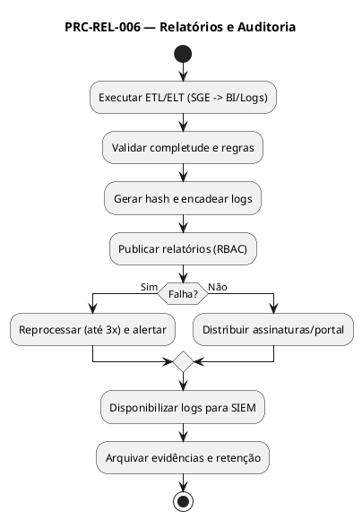

# PRC-REL-006 — Relatórios e Auditoria

## 1. Metadados do Processo
| Campo | Descrição |
|---|---|
| **Identificador** | PRC-REL-006 |
| **Nome** | Relatórios e Auditoria |
| **Objetivo** | Prover relatórios operacionais, gerenciais e estratégicos e manter trilhas de auditoria **íntegras e rastreáveis**, sustentando tomada de decisão e conformidade (LGPD, SOX-like, políticas internas Fortal). |
| **Escopo** | Todos os módulos do SGE Fortal (Recebimento, Custo, Armazenagem, Movimentação/Expedição, Inventário, Ajustes). |
| **Atores** | Gestor de Operações, Analista de Negócios, Controladoria, Auditoria Interna/Externa, TI/Administrador SGE, Data/BI. |
| **Gatilho** | Agendamentos (diário, D+1, semanal, mensal) e eventos de negócio (fechamentos, auditorias, incidentes). |
| **Resultado Esperado** | Relatórios publicados no prazo e trilhas de auditoria imutáveis com **100% de cobertura dos eventos críticos**. |

---

## 2. Entradas e Saídas

### 2.1 Entradas
- Dados transacionais dos processos PRC-REC-001, PRC-CST-007, PRC-ARM-002, PRC-MOV-003, PRC-INV-004, PRC-AJU-005.  
- Tabelas de apoio: classificações ABC-XYZ, motivos de ajuste, parâmetros de SLA.  
- Metadados e logs de aplicação (usuário, timestamp, IP/host, ação, antes/depois).  
- Parâmetros de periodicidade e destinatários (assinaturas por e-mail/portal BI).

### 2.2 Saídas
- **Relatórios Operacionais** (D-1/D0): fila de recebimento, divergências, tarefas de putaway, produtividade de picking, rupturas potenciais.  
- **Relatórios Gerenciais** (semanal/mensal): acurácia de estoque, giro, aging por validade (FEFO), perdas/ajustes por causa, OTIF.  
- **Relatórios Estratégicos** (mensal/trimestral): margem por família, eficiência logística, ocupação do CD, custo de capital imobilizado.  
- **Trilha de Auditoria**: logs imutáveis com hash, encadeados e exportáveis.  
- **Alertas**: violações de SLA, picos de divergência, suspeitas de fraude.  

---

## 3. Regras de Negócio Relacionadas (RN)
- **RN-REL-001**: Todos os eventos críticos devem gerar **log imutável** com *quem fez, o que fez, quando, onde e antes/depois*.  
- **RN-REL-002**: **Retenção mínima** dos logs de auditoria: **5 anos** (ou conforme política Fortal vigente).  
- **RN-REL-003**: **Carimbo de tempo** sincronizado via NTP corporativo; eventos fora de ordem são rejeitados.  
- **RN-REL-004**: **Segregação de funções (SoD)**: quem lança não aprova; quem aprova não audita.  
- **RN-REL-005**: Relatórios devem contemplar **metas e tolerâncias** vinculadas a KPIs oficiais.  
- **RN-REL-006**: Exportações devem preservar **integridade (hash)** e **pseudonimização** de dados pessoais (LGPD).  
- **RN-REL-007**: Falhas de geração disparam **alerta** e **rotina de reprocessamento** automático.  

---

## 4. Integrações e Dependências
- **BI Fortal** (dashboards, assinaturas, drill-down).  
- **SIEM/Monitoramento** (correlação de eventos e segurança).  
- **ERP/Financeiro (futuro)** (conciliações).  
- **Módulo de Autenticação/Perfis** (controle de acesso a pastas/visões).  
- **Armazenamento de Arquivos** (data lake, blob seguro).  

---

## 5. KPIs e SLAs

### 5.1 KPIs
- **KPI-REL-TIM** (Pontualidade de Publicação) ≥ **99%**.  
- **KPI-REL-COMP** (Completude de Colunas/Metadados) = **100%**.  
- **KPI-AUD-COV** (Cobertura de Auditoria) = **100%** dos eventos críticos.  
- **KPI-AUD-INT** (Integridade de Log) = **100%** de hashes válidos.  

### 5.2 SLAs
- **SLA-REL-001**: Publicar relatórios operacionais até **08:00** D0.  
- **SLA-REL-002**: Concluir reprocessamento automático em até **30 min** após falha.  
- **SLA-AUD-001**: Tornar disponíveis logs de auditoria **em tempo real** via consulta SIEM/BI.  

---

## 6. Riscos e Mitigações
| Risco | Impacto | Mitigação |
|---|---|---|
| Falha de agendamento | Atraso em decisões | Reprocessamento automático + alerta |
| Log incompleto | Risco de conformidade | Política de eventos críticos + testes de integridade |
| Excesso de acesso | Vazamento/alteração | RBAC, least privilege, trilha de acesso |
| Dados pessoais sensíveis | Risco LGPD | Pseudonimização/mascaração e controle de retenção |

---

## 7. Fluxo Detalhado (Passo a Passo — hierárquico)

### 7.1 Versão **Gerencial** (linguagem corporativa)
1. Planejamento  
 1.1 Definir periodicidade e público-alvo dos relatórios.  
 1.2 Validar indicadores-chave e metas.  
 1.3 Aprovar layout e cobertura de auditoria.  

2. Execução  
 2.1 Coletar dados dos módulos do SGE e consolidar no BI.  
 2.2 Publicar relatórios e distribuir aos destinatários.  
 2.3 Monitorar alertas e resolver falhas de publicação.  

3. Encerramento  
 3.1 Validar consistência e registrar aceite gerencial.  
 3.2 Arquivar versões e evidências de publicação.  
 3.3 Apontar melhorias e ajustes para o próximo ciclo.  

### 7.2 Versão **Técnica** (log/BI/segurança)
1. Geração e Validação Técnica  
 1.1 ETL/ELT extrai dados transacionais e metadados (Δ, antes/depois).  
 1.2 Aplicar **validações** de completude, chaves e business rules.  
 1.3 Gerar **hash** por lote de log (ex.: SHA-256) e encadear (Merkle-like).  

2. Publicação e Segurança  
 2.1 Publicar visões no **BI Fortal** com **RBAC** por papel.  
 2.2 Exportar relatórios assíncronos com **assinatura** e **checksum**.  
 2.3 Expor **API de logs** para SIEM e auditorias externas.  

3. Reprocessamento e Evidências  
 3.1 Detectar falhas e reprocessar automaticamente (até 3 tentativas).  
 3.2 Registrar evidências de publicação (carimbo de tempo, lote, destinatários).  
 3.3 Manter **retention policy** e política de descarte seguro.  

---

## 8. Exceções e Tratamentos
| Exceção | Condição | Tratamento | Regra |
|---|---|---|---|
| Relatório com quebra de série | Erro na fonte | Reprocessar e notificar responsáveis | RN-REL-007 |
| Log sem hash | Falha de geração | Regerar lote e sinalizar auditoria | RN-REL-001/006 |
| Acesso negado | Perfil insuficiente | Solicitar elevação via fluxo TI | RN-REL-004 |
| Atraso de publicação | Falha de agendamento | Acionar plano B e registrar evidência | RN-REL-007 |

---

## 9. Tabela de Rastreabilidade
| Artefato | Relação |
|---|---|
| **RF-REL-001, RF-REL-002, RF-REL-003** | Implementam geração, publicação e auditoria. |
| **RN-REL-001–007** | Definem integridade, retenção, segurança e reprocesso. |
| **KPIs: KPI-REL-TIM, KPI-REL-COMP, KPI-AUD-COV, KPI-AUD-INT** | Medem pontualidade, completude e integridade. |
| **Integrações: BI, SIEM, ERP, Autenticação** | Consumo e exposição de dados/logs. |

---

## 10. PlantUML (visão textual)

